    
哈喽！我是二狗子（2🐕）！仅局部重绘采样器与变异种子采样器来啦！     
Hello! I am Er Gouzi (2) 🐕）！ Only partial redrawing sampler and variant seed sampler are here!    

## 局部重绘采样器    
Local redraw sampler    
实现仅对蒙版区域进行需求分辨率的重绘（类似WebUi的仅局部重绘模式）    
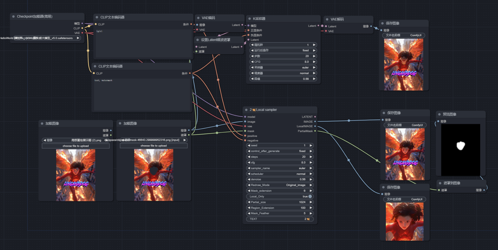  
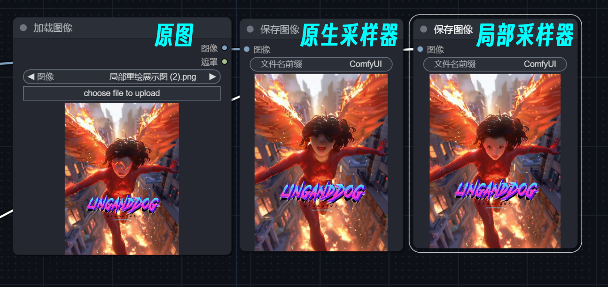    

并且保留还原非重绘区域像素空间的原像素,常规重绘模式中非重绘区域由于压缩导致像素信息丢失        
   

局部重绘采样器还原非重绘区域细节（安装原图像素）    
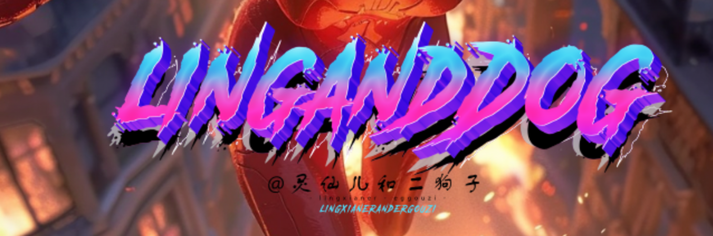     

## 变异种子采样器  
Mutant seed sampler    
通过对原噪声图seed进行组合微调实现在不改变图像构图的情况下实现微调生成    
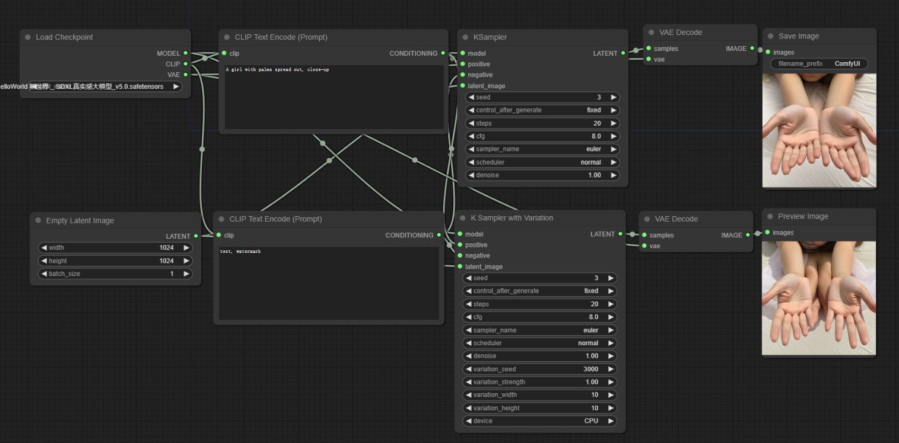      
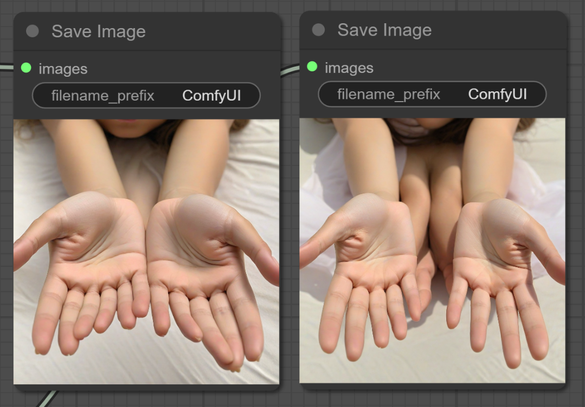     
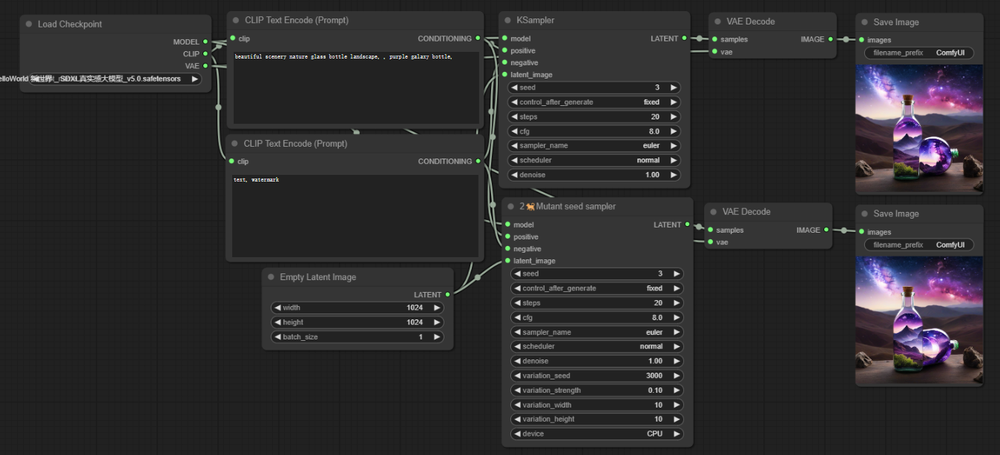     
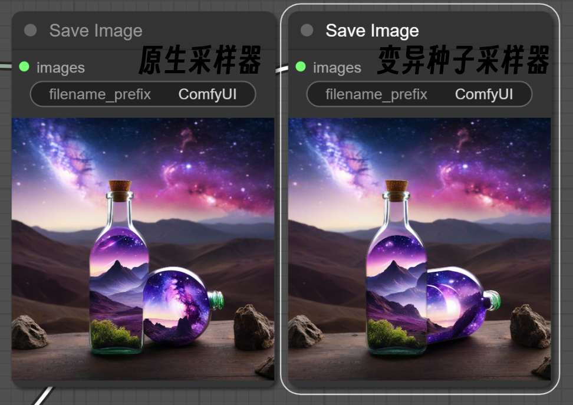        

## 局部重绘采样器的CN实现   
CN Implementation of Local Redraw Sampler    
通过2🐕Local Image节点对CN控制网进行裁剪处理以匹配局部重绘采样器    
具体连接方式可使用实例工作流
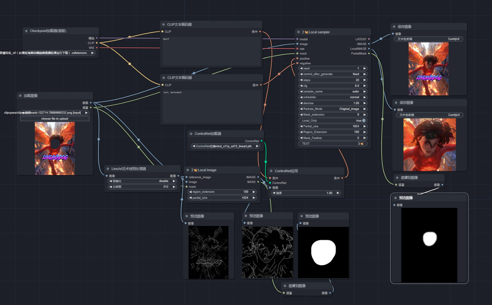
通过线稿进行局部重绘    
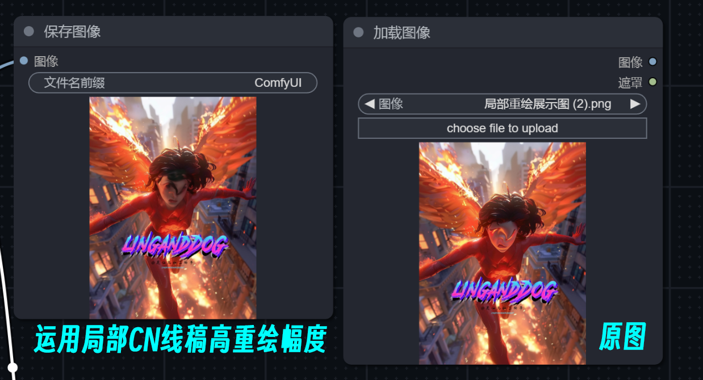    

## 局部重绘采样器参数    
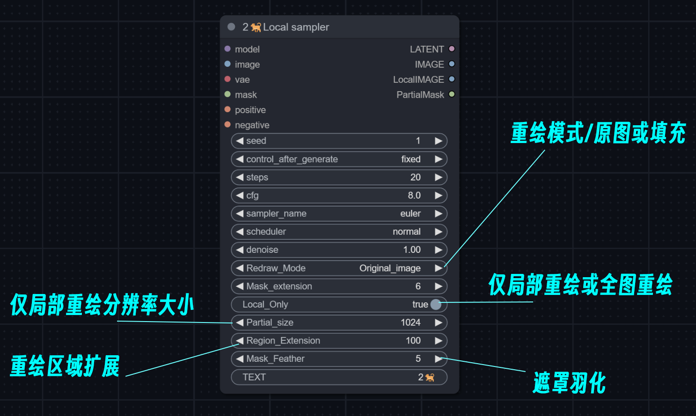    

## 局部重绘采样器CN控制网参数    
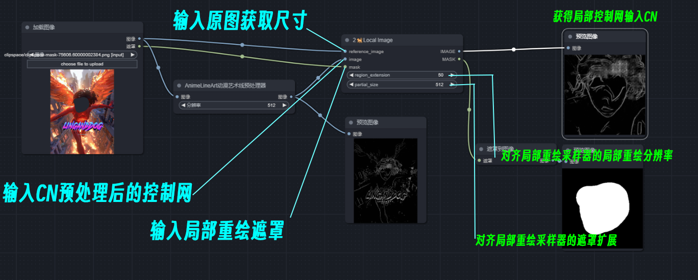    

## 变异种子采样器参数    
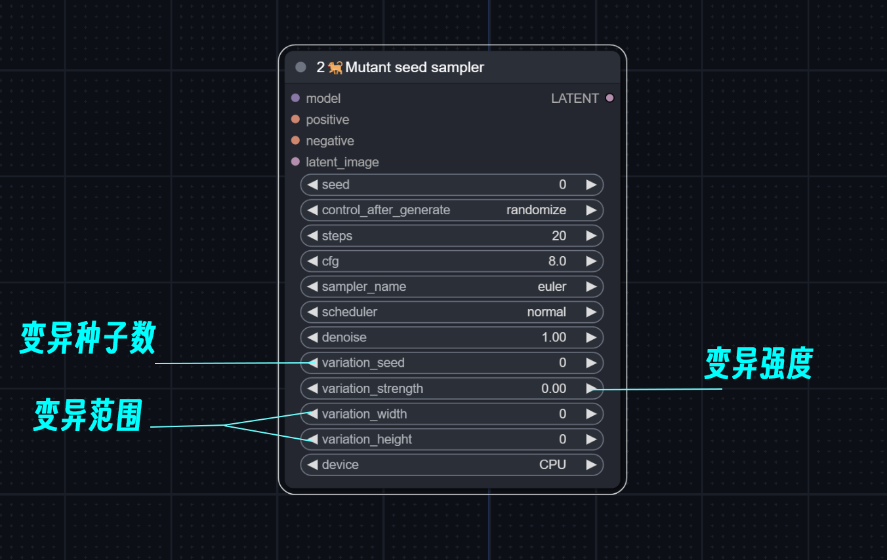 

## 更多SD免费教程
More SD free tutorials   
灵仙儿和二狗子的Bilibili空间，欢迎访问：   
Bilibili space for Lingxian'er and Ergouzi, welcome to visit:   
[灵仙儿二狗子的Bilibili空间](https://space.bilibili.com/19723588?spm_id_from=333.1007.0.0)   
欢迎加入我们的QQ频道，点击这里进入：   
Welcome to our QQ channel, click here to enter:   
[二狗子的QQ频道](https://pd.qq.com/s/3d9ys5wpr)   
    
